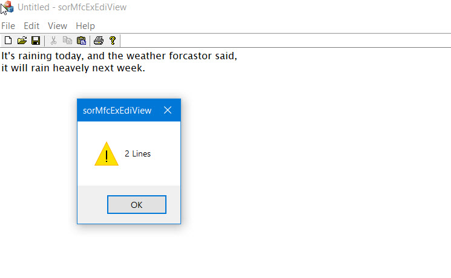

### Data save and load with Serialization in the CEditView 
---
> SDI type > View: CEditView
> Doc.Serialize handler에서서 (View:CEditView).Serialize:  호출
> 사전에 필요한 자료형 CDataTest 만듬 (Serialize 가상함수 구현 필요)

---

[ref Serialize using CEditView in MFC](https://www.youtube.com/watch?v=SPcMHGF9FQ0&list=PL7mmuO705dG2zFLKevTtK7eyTzmLxXY4W&index=54)




```
#pragma once

// CTestData command target

class CTestData : public CObject
{
	DECLARE_SERIAL(CTestData)

public:
	CTestData();
	virtual ~CTestData();

	int m_nData;
	int m_nLine;
	virtual void Serialize(CArchive& ar);
};


// CTestData.cpp : implementation file
//

#include "pch.h"
#include "sorMfcExEdiView.h"
#include "CTestData.h"


// CTestData
IMPLEMENT_SERIAL(CTestData, CObject, VERSIONABLE_SCHEMA | 2)

CTestData::CTestData()
{
	m_nData = 0;
	m_nLine = 0;
}

CTestData::~CTestData()
{
}

// CTestData member functions

void CTestData::Serialize(CArchive& ar)
{
	if (ar.IsStoring())
	{	// storing code
		ar << m_nData << m_nLine;
	}
	else
	{	// loading code
		ar >> m_nData >> m_nLine;
	}
}

----

// CsorMfcExEdiViewDoc
void CsorMfcExEdiViewDoc::Serialize(CArchive& ar)
{
	// CEditView contains an edit control which handles all serialization
	CsorMfcExEdiViewView* pEditView = (CsorMfcExEdiViewView*)m_viewList.GetHead();
	pEditView->Serialize(ar);
}

....

// CsorMfcExEdiViewView
void CsorMfcExEdiViewView::Serialize(CArchive& ar)
{
	
	CEdit&  theEdit   = GetEditCtrl();

	if (ar.IsStoring())
	{	// storing code
		
		CTestData cTestData;
		TCHAR     szBuffer[512];
		cTestData.m_nLine = theEdit.GetLineCount();

		//ar << &cTestData;

		//for (int i = 0; i < cTestData.m_nLine; i++)
		for (int i = 0; i < theEdit.GetLineCount(); i++)
		{
			::ZeroMemory(szBuffer, sizeof(szBuffer));
			if (theEdit.GetLine(i, szBuffer, 512) > 0) {
				ar.WriteString(szBuffer);
			}

			//if (i + 1 < cTestData.m_nLine) {
			if (i + 1 < theEdit.GetLineCount()) {
				ar.WriteString(_T("\r\n"));
			}
		}
	}
	else
	{	// loading code
		CString ls_strTmp     = _T("");
		CString ls_strText    = _T("");
		
		//CTestData* pcTestData = NULL;
		//ar >> pcTestData;

		int i = 0;
		while (ar.ReadString(ls_strTmp)) {
			ls_strText += ls_strTmp;
			ls_strText += "\r\n";
			i++;
		}

		theEdit.SetWindowTextW(ls_strText);
		//ls_strTmp.Format(_T("%d Lines"), pcTestData->m_nLine);
		ls_strTmp.Format(_T("%d Lines"), i);

		AfxMessageBox(ls_strTmp);

		//delete pcTestData;
	}
}
```
---

